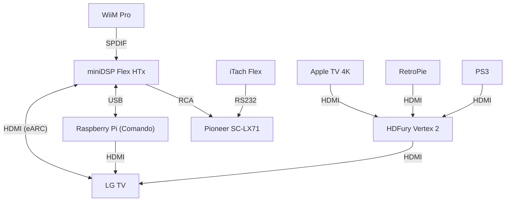

# comando

**comando** is a hobby project to create a controller/remote for my A/V devices. It is designed to run on a Raspberry Pi Zero 2 W using Raspberry Pi OS Lite (64-bit).

I'm currently using Roomie Remote for controlling my A/V system, but even though I have a cheaper subscription carried over from when it was Simple Control, I do not appreciate the subscription price gouging of Roomie Remote. Second, Roomie Remote has a lot of extra clutter I'm never using, and I'd like a simpler and laser-focused UX. Finally, I'd like to use this project as a learning experience :-)

I also have a physical Apple TV Remote. I'd like to be able to use this to control as much as possible, and limit having to reach for my phone and an app as much as possible.

**comando** consists of a back-end and a front-end:

- The back-end is Python-based. It handles all interfaces to controlled devices and exposes device state, command execution, logs, etc. via a REST API.
- The front-end is a React/Next.js based web app that can be added to iOS home screen.

I mainly use the Apple TV and the WiiM. With **comando** behind-the-scenes, 95% of the time, the Apple TV Remote should be sufficient. **comando** will monitor events such as device power state and configures inputs etc. accordingly. For example, if I start playing music via TIDAL Connect on the WiiM, **comando** should detect this and switch the input on the miniDSP. In cases where additional control is required, the front-end should be used to control the system.

Although this tool will be purpose-built for my setup, the intention is to make it flexible, scalable and adaptable to other similar setups if anyone has interest in doing so. In that case, I suggest forking this repository and going from there. It is emphasized that such use will require experience with coding as well as technical expertise; it is __not intended__ to be a direct alternative to Roomie Remote or other "plug and play" consumer-focused remote control systems.

## Setup

## Device control

Methods of device control are as follows:

| Device | Control interface |
| ------ | ----------------- |
| LG TV  | HDMI CEC |
| miniDSP Flex HTx | HDMI CEC (on/standby); USB (using minidsp-rs) |
| HDFury Vertex 2 | HDMI CEC; network/IP |
| WiiM Pro | Network/IP control |
| Apple TV 4K | HDMI CEC; network/IP |
| Pioneer SC-LX71 | RS232 via iTach Flex |

THe Pioneer SC-LX71 is an AVR which is being used as a power amp until I get a dedicated power amp which will also have 12V trigger in. At that point the power amp will be powered on/off automatically.

Other source devices (PS3, RetroPie) are not included as controllable devices, but **comando** enables input selection for them.

## Configuration

Device configuration is stored in `config.toml`. Devices are initialized and registered in `main()` in `src/comando/__init__.py`.

To run Comando, use `uv run comando [--debug]`. Logs are stored in `comando.log`. If `--debug` option is included, debug level is used for logging.

### Apple TV

Use `atvremote scan` to find devices. Set `id` in the configuration file to one of the identifiers. Use `atvremote --id <identifier> --protocol companion pair` to pair to your Apple TV and get the credentials, store these in the configuration file as `credentials`.

## Acknowledgments

| Dependency | Type | Remarks |
| ---------- | ---- | ------- |
| [minidsp-rs](https://github.com/mrene/minidsp-rs) | CLI/API | Control of miniDSP Flex HTx |
| [cec-utils](https://manpages.debian.org/testing/cec-utils/cec-client.1.en.html) | CLI | For testing/configuration of HDMI CEC, see [this guide](https://pimylifeup.com/raspberrypi-hdmi-cec/) |
| [cec-ctl](https://manpages.debian.org/bookworm/v4l-utils/cec-ctl.1.en.html#help~21) | CLI | Alternative to cec-utils |
| [cec](https://github.com/trainman419/python-cec) | Python package | CEC control of on/standby for LG TV and miniDSP Flex HTx |
| [pyatv](https://pyatv.dev/) | Python package | Client library for Apple TV and AirPlay devices |
| [httpx](https://www.python-httpx.org/) | Python package | Next-generation HTTP client for Python |

## Development

### Front-end/app

Run the development server `npm run dev`.

### Server/API

Run the development server `uv run comando --reload`.

### Building

1. Run `npm run build` to build a production version of the app to be served by the server.
2. Run `uv build --wheel` to build the Python package.

### Installation

1. Install the Python package using `uv tool install <package.whl>`.
2. Run `uvx comando` to start the server.

TODO: config.toml should be included in the package.