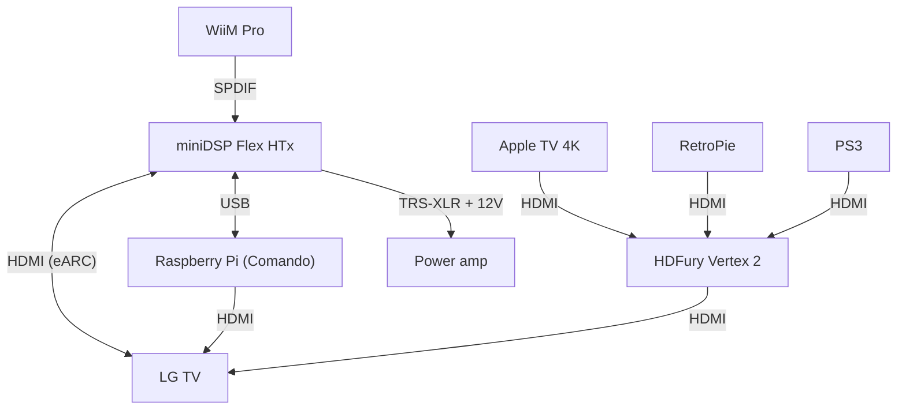

# comando

**comando** is a hobby project to create a controller/remote for my A/V devices. It is designed to run on a Raspberry Pi Zero 2 W using Raspberry Pi OS Lite (64-bit).

I'm currently using Roomie Remote for controlling my A/V system, but even though I have a cheaper subscription carried over from when it was Simple Control, I do not appreciate the subscription price gouging of Roomie Remote. Second, Roomie Remote has a lot of extra clutter I'm never using, and I'd like a simpler and laser-focused UX. Finally, I'd like to use this project as a learning experience :-)

I also have a physical Apple TV Remote. I'd like to be able to use this to control as much as possible, and limit having to reach for my phone and an app as much as possible.

**comando** consists of a back-end and a front-end:

- The back-end is Python-based. It handles all interfaces to controlled devices and exposes device state, command execution, logs, etc. via a REST API.
- The front-end is a React/Next.js based web app that can be added to iOS home screen.

I mainly use the Apple TV and the WiiM. The intention is that 95% of the time, the Apple TV Remote should be sufficient. **commando** will monitor events such as device power state and configures inputs etc. accordingly. For example, if I start playing music via TIDAL Connect on the WiiM, **commando** should detect this and switch the input on the miniDSP. In cases where additional control is required, the front-end should be used to control the system.

## Setup

## Device control

Methods of device control are as follows:

| Device | Control interface |
| ------ | ----------------- |
| LG TV  | HDMI CEC (on/standby); network/IP control |
| miniDSP Flex HTx | HDMI CEC (on/standy), USB |
| HDFury Vertex 2 | Network/IP control |
| WiiM Pro | Network/IP control |
| Apple TV 4K | HDMI CEC |

Other source devices (PS3, RetroPie) are not included as controllable devices, but **commando** enables input selection for them.

## Dependencies

| Dependency | Type | Remarks |
| ---------- | ---- | ------- |
| [minidsp-rs](https://github.com/mrene/minidsp-rs) | CLI/API | Control of miniDSP Flex HTx |
| [cec-utils](https://manpages.debian.org/testing/cec-utils/cec-client.1.en.html) | CLI | For testing/configuration of HDMI CEC |
| [cec](https://github.com/trainman419/python-cec) | Python package | CEC control of on/standby for LG TV and miniDSP Flex HTx |
| [bscpylgtv]() | Python package | Network/IP control of LG TV |
| [PyTach]() | Python package | Hopefully not needed, but I have a couple of Global Caché iTach Flex which can be used to bridge IR and RS232 control to network/IP |

